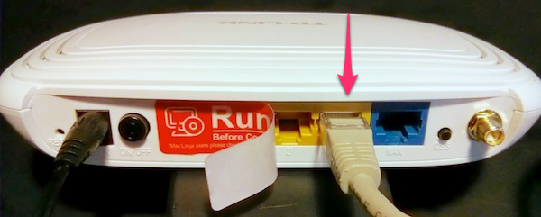
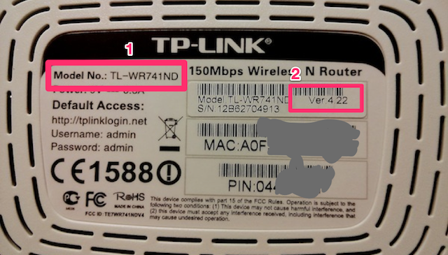
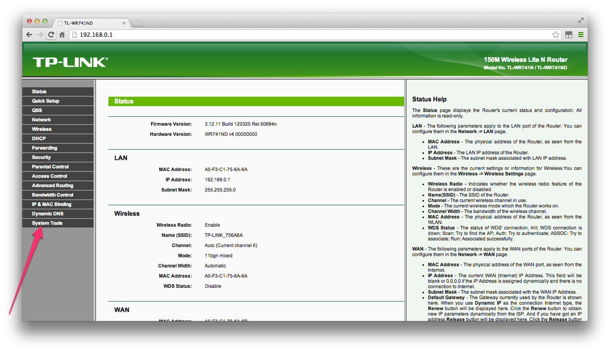
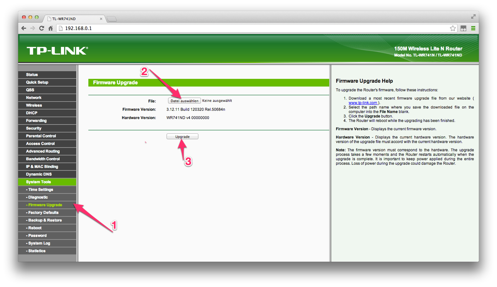
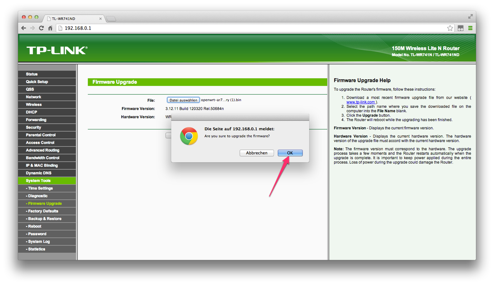

#  Freifunk Hamburg Router Firmware einspielen
### Schritt für Schritt Anleitung
## Einleitung
Um einen Router als Freifunk Router zu nutzen ist es erforderlich dort das Freifunk Betriebssystem – die Freifunk Firmware – zu installieren.

Die Installation ist ganz einfach und Du benötigst keine technischen Kenntnisse. Wenn du dieser Anleitung folgst kann eigentlich nichts schiefgehen.

Anmerkung: Diese Anleitung geht davon aus, dass du einen relativ neuen Router von TP-Link verwendest und noch keine Freifunk-Firmware auf deinem Router läuft. Wenn du einen anderen Router hast, oder einen älteren, oder ein Update machen willst, bitte lies die Anweisungen im (http://wiki.freifunk.net/Freifunk_Hamburg/Firmware.
Los geht's!

## 1. Freifunk-Router mit dem Computer verbinden

Bitte schließe deinen Router (1) (Die Antenne (2) kannst du jetzt oder auch später aufschrauben.) an eine Steckdose an - Das Kabel dazu ist dabei (3). Verbinde dann den Router mit dem beiliegenden grauen LAN-Kabel (4) mit Deinem Computer. 

Stecke dafür das Kabel in eine der gelben Buchsen (die blaue brauchst du später).

## 2. Firmware runterladen
Derzeit gibt es die Hamburg Freifunk als fertigen Download für zwei verschiedene Router-Typen. 

Herauszufinden welche Firmware du brauchst ist ganz einfach:
Der Router-Typ (1) und die Hardware-Version (2) steht auf der Rückseite des Routers.

### TP-Link TL-WR740N / TL-WR741ND (der Router mit nur einer Antenne):

Version __[4.x](http://freifunk-gw01.hamburg.ccc.de/ffhh/openwrt-ar71xx-generic-tl-wr741nd-v4-squashfs-factory.bin)__

### TP-Link TL-WR842ND (der Router mit zwei Antennen)

Version __[1.x](http://freifunk-gw01.hamburg.ccc.de/ffhh/openwrt-ar71xx-generic-tl-wr842n-v1-squashfs-factory.bin)__ 

Wenn du einen anderen Router verwendest, oder wenn du eine ältere Version der genannten Router hast, kannst du im [Wiki](http://wiki.freifunk.net/Freifunk_Hamburg/Firmware#Download) die entsprechende Version der Firmware laden.

## 3. Firmware einspielen
Jetzt kannst du den Router einfach über den Browser konfigurieren. 

Dazu rufst du in deinen Browser folgende Adresse auf: __<http://192.168.0.1>__

Dein Browserfenster müsste nun so aussehen – Folge hier dem Link "System Tools".

Als nächste wählst du aus dem Menü "Firmware Upgrade" (1). Danach kannst du die vorhin (in Schritt 2) geladene Datei zum Hochladen auswählen (2). Nach einem Klick auf "Upgrade" (3) beginnt der Prozess.

Du musst noch einmal kurz bestätigen … 

… und die Installation läuft.

## 5. Abschluss 

Nachdem die Firmware fertig eingespielt ist, startet der Router neu. 

Nach dem Neustart ist der Router nicht mehr unter der angegeben Adresse sichtbar und eine Fehlermeldung erscheint. Das ist gut so. Denn nun läuft nicht mehr die alte Firmware sondern die neue, tolle Freifunk Firmware auf deinem Router.

Als nächstes musst du deinen Router noch einrichten und im Freifunk Netz anmelden. Auch das ist ganz einfach. Eine Anleitung findest du hier.

## Fragen?
Solltest Du Fragen oder Probleme haben oder Einträge deines Knoten ändern wollen, schreibe gerne an 

__<kontakt@hamburg.freifunk.net>__!

