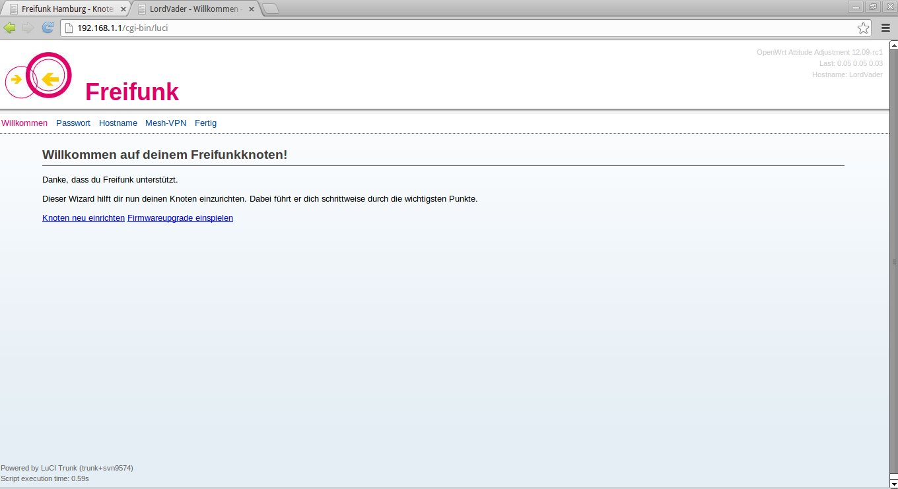
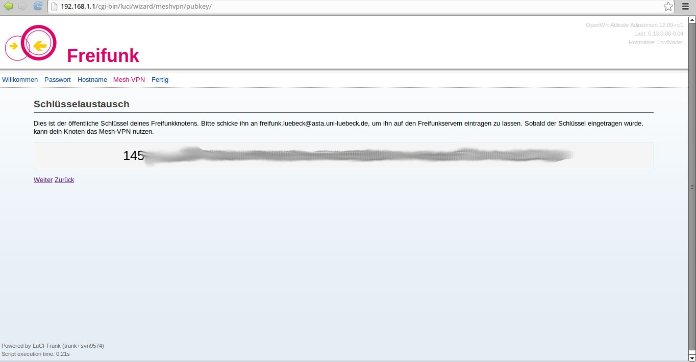
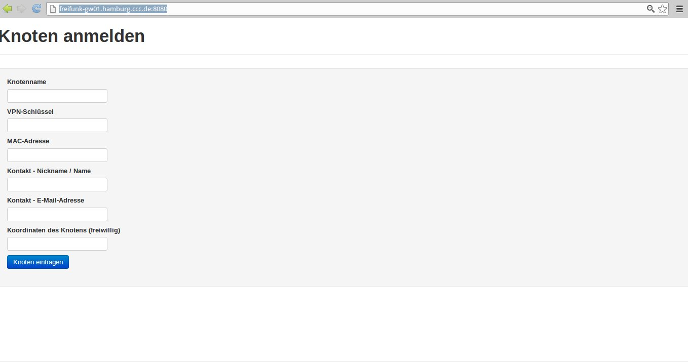

# Anleitung – Freifunk Hamburg Router einrichten

## Einleitung
Das Einrichten des Routers ist ganz einfach und Du benötigst keine technischen Kenntnisse. 

Diese Anleitung erklärt Schritt für Schritt wie's geht. Wenn du dieser Anleitung folgst kann eigentlich nichts schiefgehen.

## 1. Freifunk-Router mit dem Computer verbinden
Bitte schließe deinen Router an eine Stekcdose an - Das Kabel dazu ist dabei. Verbinde dann den Router mit dem beiliegenden Lankabel mit Deinem Computer. Stecke dafür das Kabel in eine der gelben Buchsen (die blaue brauchst du später).

:: Bild einfügen.

## 2. Konfiguration starten
Jetzt kannst du den Router einfach über den Browser konfigurieren. Dazu rufst du in deinen Browser folgende Adresse auf: 
<http://192.168.1.1>

Dein Browserfenster müsste nun so aussehen:

Folge dem Configmode und gibt mir ein Passwort, einen Namen und wähle die Meshoptionen.
:: kann glaub ich weg. Wichtig: Du kommst jederzeit durch Drücken der QSS-Taste wieder in meinen Configmode und kannst Einstellungen ändern.

## 3. Dein Schlüssel
Nun bekommst Du einen Schlüssel:

Diesen Schlüssel musst Du dir aufschreiben! Du kannst ihn zusätzlich in die Zwischenablage kopieren!

Noch einmal auf Weiter und auf „Jetzt Neustarten“ und ich starte neu und bin fast bereit...

Wichtig: Wenn ich keine anderen Freifunk-Knoten sehe, kann ich nicht „meshen“ und das Freifunk-Netz vergrößern. Ich brauche in diesem Fall eine Internetverbindung um ein Teil des Freifunk-Netzes zu werden – Bitte schließe mich mit einem Lankabel an Deinen Heimrouter an - 
Wichtig: benutze dafür nur meine blaue Buchse und NICHT eine meiner gelben Buchsen!

Nun musst Du mich über dieses Formular mit dem Freifunk-Netz bekannt machen:
<http://freifunk-gw01.hamburg.ccc.de:8080/>

Hier trägst Du nun meinen Namen, meinen Schlüssel, meine MAC-Adresse (steht unten auf meinem Gehäuse), Deinen Namen und eine E-Mail-Adresse. Außerdem kannst Du meinen Standort eintragen – so kann man mich leichter finden :-) 

Unter http://freifunk-gw01.hamburg.ccc.de/ffhhmap/geomap.html, mit der Option „Koordinaten beim nächsten Klick zeigen“ findest Du die Koordinaten meines zukünftigen Standortes.
Dann kannst Du mich eintragen und ich werde ein Teil des Netzes – habe ein bisschen Geduld,
es kann manchmal ein bisschen dauern.

Solltest Du Fragen oder Probleme haben oder Einträge deines Knoten ändern wollen,
schreibe gerne an <kontakt@hamburg.freifunk.net>!

Ein wichtiger Hinweis: Als Schutz gegen die Störerhaftung wird das Freifunk-Netz in die Niederlande getunnelt. Das kann bedeuten, dass Dich Facebook, Googlemail, etc. warnen, Du seist im Ausland.

Erschrick bitte nicht – in machen Warnungen ist von „Hackerangriffen“ etc. die Rede.  

V1.1
