## Einleitung
Für die Einrichtung des Routers werden keine technischen Kenntnisse benötigt. Wenn du dieser Anleitung Schritt für Schritt folgst, kann eigentlich nichts schiefgehen. Wenn du fertig bist, läuft das Freifunk WLAN und ist für alle in der Nähe als offenes WLAN mit der SSID "hamburg.freifunk.net" zu sehen.

Dein Router sollte das Freifunk Betriebssystem bereits installiert haben. Ob das so ist, erfährst du von dem Freifunker, von dem du das Gerät bekommen hast.
Wenn dein Router noch nicht das Freifunk-Betriebssystem installiert hat, findest du [hier](https://hamburg.freifunk.net/kurzanleitung/) eine Schritt-für-Schritt-Anleitung.

## Router einrichten

### 1. Freifunk-Router mit dem Computer verbinden

_Deinem Router (1) liegen mindestens eine Antenne (2), ein Steckernetzteil (3) und ein LAN-Kabel (4) bei._

Bitte schraube zuerst die Antenne(n) auf die Gewindestecker des Routers. Schließe danach den Router mit dem Steckernetzteil an eine Steckdose an. Verbinde dann den Router mit dem beiliegenden LAN-Kabel (4) mit Deinem Computer. Stecke es dabei am Router in eine gelbe Buchse.

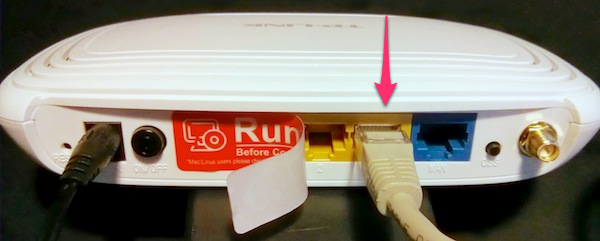

_Anmerkung: Bei manchen Routern kann es sein, dass du die blaue Buchse verwenden musst. Probier's einfach aus, wenn es mit gelb nicht klappt._

### 2. Router konfigurieren
Jetzt kannst du den Router einfach über den Browser konfigurieren. 

Dazu rufst du in deinem Browser folgende Adresse auf: 

**<http://192.168.1.1>**

Dein Browserfenster müsste nun aussehen. Hier kannst du die wichtigsten Einstellungen für deinen Router vornehmen.

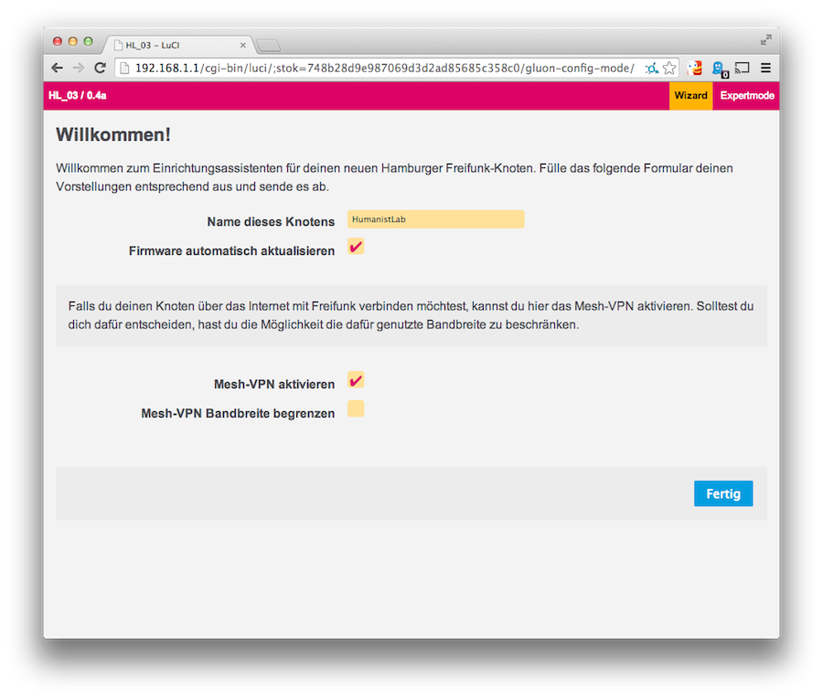

#### Name
Als erstes musst du deinem Router einen Namen geben. Nimm einfach einen, der dir gefällt und der vielleicht ein wenig über den Standort des Routers aussagt. z.B. HumanistLab.
Bitte achte darauf, dass keine Leerzeichen im Namen erlaubt sind. Wenn du ein Leerzeichen brauchst, verwende einfach einen Unterstrich "_".

Dieser Name wird später noch einmal benötigt. Am besten öffnest du jetzt einen Texteditor und kopierst ihn dort hinein.

#### Firmware automatisch aktualisieren
Diese Option ist vorausgewählt. Wenn du die Auswahl stehen lässt, wird sich dein Router automatisch immer das aktuellste Freifunk-Betriebssystem installieren. Das spart eine Menge Zeit für die Zukunft und sorgt für Sicherheit. Warum sollte man es abstellen wollen? 

#### Mesh-VPN
Auch diese Option ist vorausgewählt - und das aus gutem Grund: Du erlaubst deinem Freifunk-Router über deinen Internetanschluss  eine verschlüsselte Verbindung zum Freifunk-Server herzustellen. Wenn du diese Option deaktivierst, kann der Router nur mit den Routern kommunizieren, die er direkt oder indirekt per WLAN oder über andere Router mit aktivierter Option erreicht. Der Zugang zum Internet ist dann nur möglich, wenn mindestens bei einem der erreichbaren Router die Option aktiviert ist. 
Auch hier: Wir empfehlen den Haken gesetzt zu lassen.

#### Mesh-VPN Bandbreite begrenzen
Wenn du einen normalen Internet-Anschluss hast, brauchst du die Begrenzung nicht zu aktivieren. Dein Router wird im alltäglichen Betrieb nicht allzuviel von deiner Bandbreite in Anspruch nehmen. Unsere Empfehlung ist deshalb, die Begrenzung nicht zu aktivieren.
Solltest du aber trotzdem eine Begrenzung eintragen wollen, setze den Haken "Mesh-VPN Bandbreite begrenzen?". Daraufhin erscheinen zwei neue Felder. Trage in die beiden Felder darunter die gewünschten Limits ein. Die Minimalwerte sind 1000 im oberen und 100 im unteren Feld.

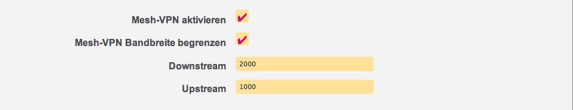

Wenn du alle Daten eingegeben und noch mal geprüft hast bist du fertig und klickst beherzt auf: "Fertig".

_Anmerkung: Für erweiterte Einstellungen gibt es auch noch den Expertmode (rechts oben). Höchstwahrscheinlich musst du dir diese Einstellungen nicht einmal ansehen._

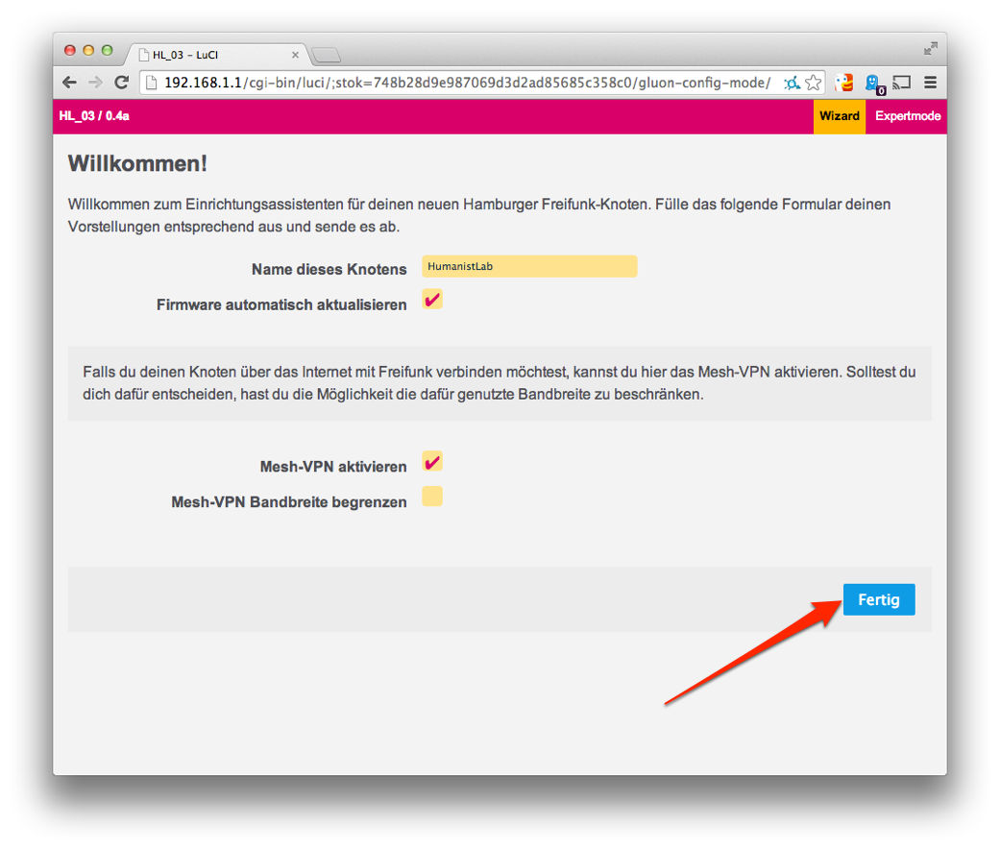

#### (Fast) Geschafft!
Dein Freifunk-Router ist nun fertig eingerichtet - aber du bist noch nicht ganz fertig!

Dein Browser müsste nun so aussehen:

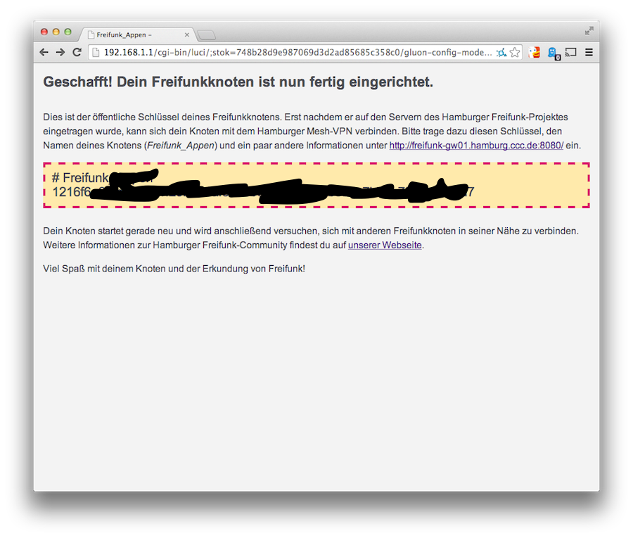

Wichtig: Unter dem Namen deines Freifunk-Routers wird eine lange, unverständliche Zeichenkette angezeigt. Das ist der sogenannte VPN-Schlüssel. Den benötigst du später zur Registrierung deines Routers im Freifunk-Netz. Kopier ihn am besten ebenfalls in den Texteditor.

### 3. Router anschließen
Nun kannst du den Router ans Internet anschließen. Dazu musst du das LAN-Kabel auf der Rückseite deines Routers umstecken: Bisher hattest du das Kabel in der gelben Buchse (Bei den meisten Modellen). Jetzt muss es in die blaue. Verbinde dann noch das andere Ende des Kabels mit deinem Internet-Router und dein neuer Freifunk-Router ist am Netz.

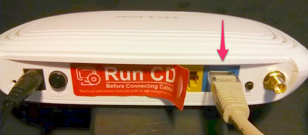

Alternativ kannst du deinen Router auch nur zum Meshing verwenden. Dazu muss allerdings mindestens ein anderer Freifunk-Router in WLAN-Reichweite sein. Wenn einer der Router in dem Mesh-Netzwerk eine Internet-Verbindung hat, wird diese mit deinem Router geteilt. Das ist auch gut, aber wir empfehlen trotzdem den Freifunk-Router an deinen Internet-Router anzuschließen, wenn dir das möglich ist. Nur so teilst du deine Bandbreite mit anderen.

### 4. Router im Netz registrieren
Nun musst du nur noch deinen Router über folgendes Formular im Freifunk-Netz anmelden:

**<http://freifunk-gw01.hamburg.ccc.de:8080/>**

#### Einrichtung Starten

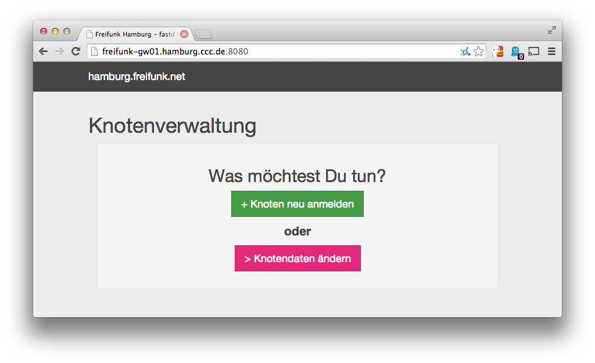 

Auf dieser Seite hast du zwei Optionen: einen neuen Router anmelden oder die Daten eines bestehende ändern. Klicke hier einfach auf "+Knoten neu anmelden"

_Anmerkung: Dein Router wird ab hier immer "Knoten" genannt. Das ändert für dich nichts. Aber es suggeriert auf halbwegs subtile Weise, dass er bald im Netz ist. :-)_

#### Freifunk-Router anmelden
Jetzt kannst du deinen Router über ein einfaches Formular anmelden. Was die einzelnen Felder bedeuten und wie sie auszufüllen sind, wird im Folgenden erklärt.

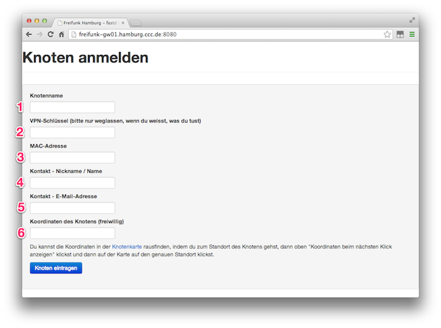 

**1. Name**
Gib hier den Namen an, den du vorhin während der Einrichtung in Schritt 4 vergeben hast. Unter diesem Namen ist dein Router bei Freifunk zu sehen.

**2. VPN-Schlüssel**
Trage hier den VPN-Schlüssel ein (die lange, unverständliche Zeichenkette, remember?).

**3. MAC-Adresse angeben**
Als nächstes brauchst du die MAC-Adresse von der Unterseite des Routers. Die MAC-Adresse ist eine eindeutige Identifikationsnummer die der Hersteller für jedes Gerät vergibt.

Wenn du sie in das Formular eingibst, füge bitte nach jedem zweiten Buchstaben einen Doppelpunkt hinzu. Leider schreibt der Hersteller die MAC-Adresse ohne Doppelpunkte.
Schreib also:
0A:F3:45:… anstatt 0AF345…

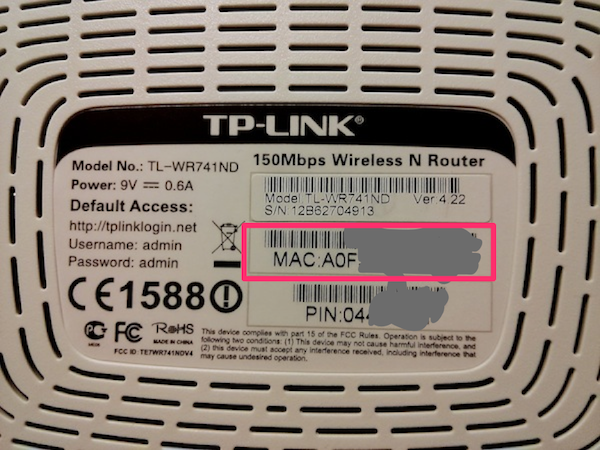

**4. Kontakt – Nickname / Name**
Unter diesem Kontakt wird dich Freifunk nur selten ansprechen. Z.B. wenn ein wichtiges Update des Freifunk-Betriebssystems für deinen Router verfügbar ist.

**5. Kontakt – E-Mail Adresse**
Wie unter 4 gesagt, wird dich Freifunk unter dieser E-Mail nur selten ansprechen. Kein Spam – versprochen.

**6. Koordinaten des Knotens**
Wenn du die Geo-Koordinaten des Standorts deines Routers hier einträgst, ist er auf der Karte der Zugangspunkte zu sehen. So können alle feststellen, wo überall Freifunk verfügbar ist. Diese Angabe ist freiwillig, aber empfohlen.

Die Geo-Koordinaten des Standorts zu ermitteln, ist ganz einfach:
Geh auf die [Karte der Freifunk-Zugangspunkte](http://knotenkarte.de).
Dein Browserfenster sollte dann ungefähr so aussehen:

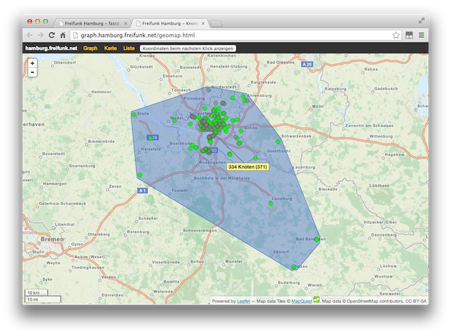

Zoome nun zu dem Ort, an dem du den Router aufstellen willst. Klicke dann auf den Button „Koordinaten beim nächsten Klick zeigen“ (1) und nachfolgend auf den gewählten Ort (2).

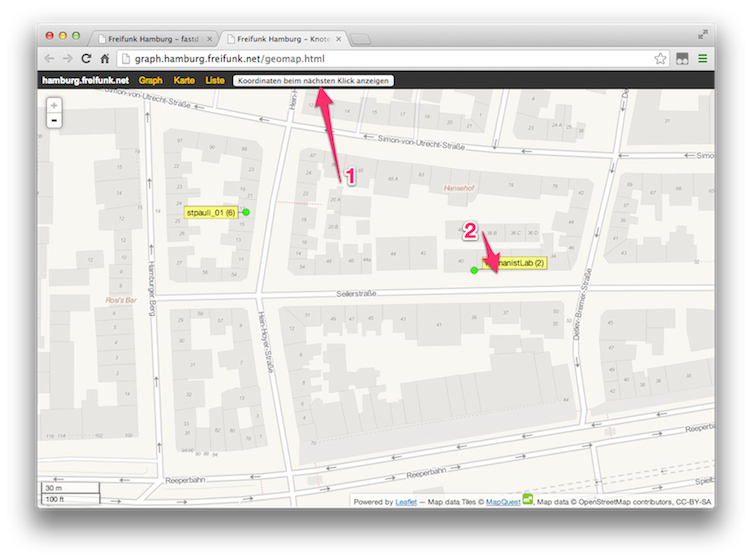

In dem daraufhin erscheinenden kleinen Fenster werden nun dessen Geo-Koordinaten angezeigt. Kopiere sie in das Formularfeld.

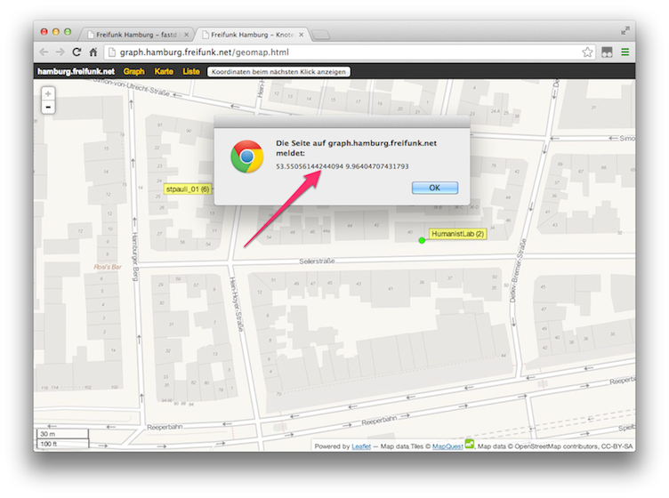

#### Formular Abschicken
Wenn das Formular fertig ausgefüllt ist, schicke es mit einem Klick auf „Knoten eintragen“ ab. Wenn Alles geklappt hat müsste dein Browserfenster ähnlich aussehen, wie im folgenden Bild. 

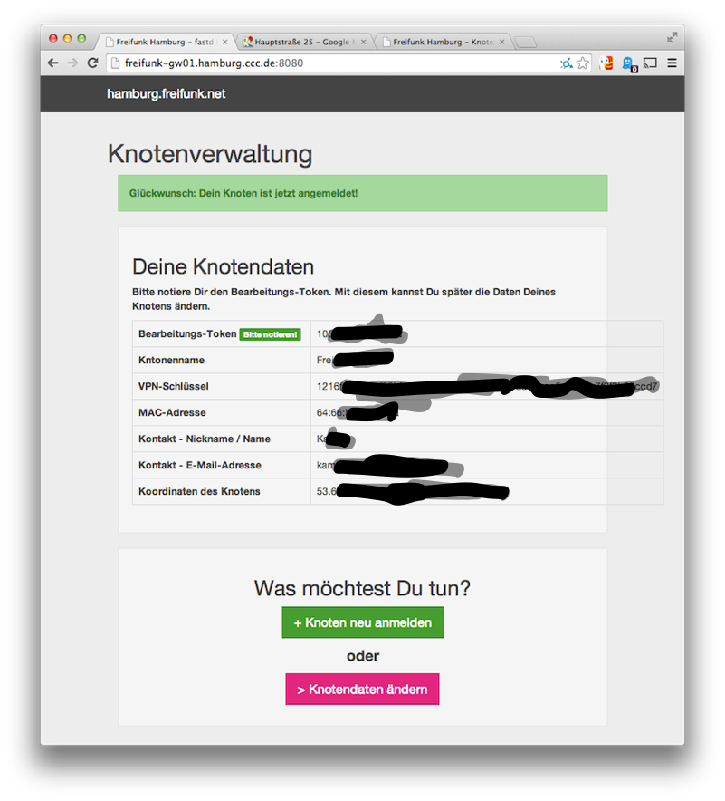

Damit ist die Registrierung abgeschlossen und du kannst deinen Freifunk-Router nun in Betrieb nehmen.

**Wichtig: Notiere dir unbedingt das _Bearbeitungs-Token_.** _Damit kannst du später die Daten deines Routers anpassen. z.B. wenn dir der Name nicht mehr gefällt, oder du den Router wo anders aufstellst und neue Koordinaten des Knotens eingeben willst. Du fragst dich wie das geht? Klicke einfach bei <http://freifunk-gw01.hamburg.ccc.de:8080/> auf "> Knotendaten ändern" und ändere dann die Daten deines Knotens_

Nach wenigen Minuten sollte der Router auf der Karte an der von dir angegebenen Position zu sehen sein. Wenn ein grüner Punkt angezeigt wird, ist alles in Ordnung und dein Router ist am Netz. Wenn zusätzlich noch eine Verbindungslinie zu einem anderen Knoten zu sehen ist, dann mesht dein Router mit einem anderen.  

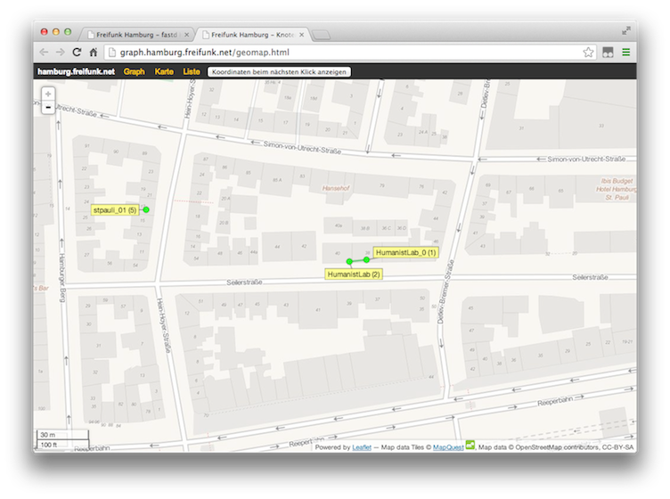

Jetzt hast du's geschafft. Klopf dir auf die Schultern, freu dich und verbreite die Botschaft von Freifunk weiter. 

## Fragen?
Solltest du Fragen oder Probleme haben oder Einträge deines Knoten ändern wollen, schreibe gerne an 

**<kontakt@hamburg.freifunk.net>**!

## Noch ein wichtiger Hinweis zum Schluss 
Das Freifunk-Netz wird in die Niederlande getunnelt. Das kann bedeuten, dass dich Facebook, Googlemail, etc. warnen, du seist im Ausland. Erschrick nicht, obwohl in machen Warnungen von „Hackerangriffen“ etc. die Rede ist. Das ist ganz normal und es soll auch so sein. Diese Maßnahme dient dem Schutz vor der Störerhaftung.

