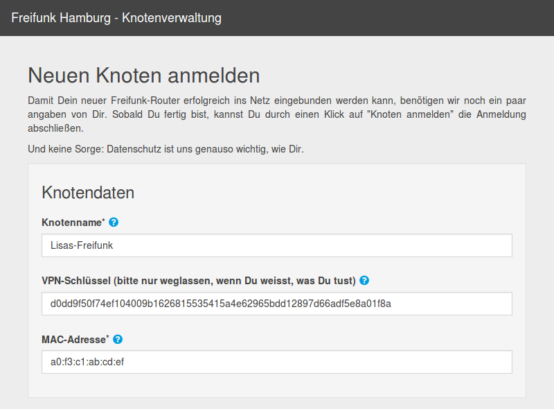

## Einleitung
Für die Einrichtung des Routers werden keine technischen Kenntnisse benötigt. Wenn du dieser Anleitung Schritt für Schritt folgst, kann eigentlich nichts schiefgehen. Wenn du fertig bist, läuft das Freifunk WLAN und ist für alle in der Nähe als offenes WLAN mit dem Namen "hamburg.freifunk.net" zu sehen.

Dein Router sollte das Freifunk-Betriebssystem (die "Firmware") bereits installiert haben.
Falls dein Router noch keine Freifunk-Firmware installiert hat, findest du [hier](https://hamburg.freifunk.net/anleitung) eine Schritt-für-Schritt-Anleitung und die Termine der Freifunk-Treffen.

## Router einrichten

### 1. Freifunk-Router mit dem Computer verbinden

_Deinem Router (1) liegen mindestens eine Antenne (2), ein Steckernetzteil (3) und ein LAN-Kabel (4) bei._

Bitte schraube zuerst die Antenne(n) auf die Gewindestecker des Routers. Schließe danach den Router mit dem Steckernetzteil an eine Steckdose an. Verbinde dann den Router mit dem beiliegenden LAN-Kabel (4) mit Deinem Computer. Stecke es dabei am Router in eine gelbe Buchse.

### 2. Router konfigurieren
Jetzt kannst du den Router einfach über den Browser konfigurieren. 

Dazu rufst du in deinem Browser folgende Adresse auf: 

**<http://192.168.1.1>**

Dein Browserfenster müsste nun wie folgt aussehen. Hier kannst du die wichtigsten Einstellungen für deinen Router vornehmen.

#### Name dieses Knotens
Als erstes solltest du deinem Router einen Namen geben. Nimm einfach einen, der dir gefällt und vielleicht etwas über den Standort des Routers aussagt. (Im Beispiel verwenden wir "Lisas-Freifunk".)
Bitte achte darauf, dass keine Leerzeichen im Namen enthalten sind. Verwende stattdessen einfach einen Bindestrich ("-") oder Unterstrich ("_").

#### Mesh-VPN aktivieren (empfohlen)
Wenn du bei "Mesh-VPN aktivieren" ein Häkchen setzt, wird über deinen Internet-Anschluss eine verschlüsselte Verbindung zu den Freifunk-Servern hergestellt. Diese verbinden deinen Router dann mit weit entfernten Freifunk-Routern und dem Internet, ohne Störerhaftung.

Wenn die Option deaktiviert bleibt, kann sich dein Router nur mit anderen Freifunk-Routern in der Nachbarschaft verbinden. Internet-Zugang ist dann nur möglich, wenn einer der anderen Router ihn anbietet.

Wir empfehlen dieses Häkchen zu setzen.

#### Mesh-VPN Bandbreite begrenzen (optional)
Wenn du einen normalen Internet-Anschluss hast, wird dein Freifunk-Router im alltäglichen Betrieb nicht allzuviel von deiner Bandbreite in Anspruch nehmen. Unsere Empfehlung ist deshalb, die Begrenzung nicht zu aktivieren.
Solltest du aber trotzdem eine Begrenzung eintragen wollen, setze den Haken "Mesh-VPN Bandbreite begrenzen". Daraufhin erscheinen zwei neue Felder. Trage in die beiden Felder darunter die gewünschten Grenzen in kbit/s ein. Die minimal sinnvollen Werte sind "1000" für Downstream und "100" für Upstream.

")

Wenn du alle Daten eingegeben und noch mal geprüft hast, bist du fertig und klickst beherzt auf "Fertig".

#### (Fast) Geschafft!
Dein Freifunk-Router ist nun fertig eingerichtet - aber du bist noch nicht ganz fertig!

Dein Browser müsste nun so aussehen:

Unter dem Namen deines Freifunk-Routers wird eine längere Zeichenkette angezeigt. (Im Beispiel ist es "d0dd...".) Das ist der sogenannte VPN-Schlüssel deines Routers. 

**Wichtig:** Schliesse diese Seite bitte noch nicht, denn über den angezeigten Link musst du deinen Freifunk-Router noch im Netz registrieren.

### 3. Router im Netz registrieren
Klicke jetzt den angezeigten Link. Dann wird automatisch das Knotenformular geöffnet und ausgefüllt.

#### Knotendaten

**Knotenname**
Der Name, den du vorhin in Schritt 2 vergeben hast. Unter diesem Namen ist dein Router bei Freifunk [zu sehen](https://hamburg.freifunk.net/wo-wird-gefunkt).

**VPN-Schlüssel**
Die längere Zeichenkette, die vorhin auf der Konfigurationsseite zu sehen war.

**MAC-Adresse**
Die MAC-Adresse deines Routers findest du auf der Unterseite:

#### Geo-Koordinaten

Wenn du die Geo-Koordinaten deines Routers hier einträgst, ist er auf der Knotenkarte zu sehen. So können alle feststellen, wo überall Freifunk verfügbar ist. Diese Angabe ist freiwillig, aber empfohlen.

Die Koordinaten zu ermitteln, ist ganz einfach: zoome zu dem Ort, an dem du den Router aufstellen möchtest. Klicke dann auf der Karte den Standort des Routers an. Die Koordinaten werden daraufhin in das Formular eingetragen.

#### Kontaktdaten

Bitte hinterlege hier einen Namen und eine gültige E-Mail-Adresse, unter der Freifunk dich bezüglich deines Routers kontaktieren kann. Keine Angst, dies geschieht nur sehr selten.

#### Formular abschicken
Wenn das Formular fertig ausgefüllt ist, schicke es mit einem Klick auf "Knoten anmelden" ab. Wenn alles geklappt hat, müsste dein Browserfenster aussehen wie auf dem folgenden Bild.

Damit ist die Registrierung abgeschlossen und du kannst deinen Freifunk-Router nun in Betrieb nehmen.

**Wichtig: Notiere dir unbedingt das _Bearbeitungs-Token_.** _Damit kannst du später die Daten deines Routers anpassen, z.B. wenn dir der Name nicht mehr gefällt, oder du den Router woanders aufstellst und neue Koordinaten eingeben möchtest. Du fragst dich wie das geht? Klicke einfach bei <http://formular.hamburg.freifunk.net/> auf "Ändere die Daten Deines Knotens" und gib dein Bearbeitungs-Token an._

### 4. Router anschließen
Wenn du vorhin das Mesh-VPN aktiviert hast, kannst du den Router nun ans Internet anschließen. Dazu musst du (bei den meisten Modellen) das LAN-Kabel auf der Rückseite von der gelben in die blaue Buchse umstecken. Das andere Ende des Kabels gehört in deinen Internet-Router.

Ohne Internet-Anschluss kommuniziert dein Router nur mit anderen Freifunk-Routern in WLAN-Reichweite. Wenn einer der anderen Router eine Internet-Verbindung hat, wird diese mit deinem Router geteilt. Das ist auch gut, aber wir empfehlen trotzdem den Freifunk-Router an deinen Internet-Router anzuschließen, wenn dir das möglich ist. Nur so teilst du deine Bandbreite mit anderen.

Nach wenigen Minuten sollte der Router auf der Knotenkarte <http://knotenkarte.de> an der von dir angegebenen Position zu sehen sein. Wenn ein grüner oder blauer Punkt angezeigt wird, ist alles in Ordnung und dein Router ist am Netz. Wenn zusätzlich noch eine Verbindungslinie zu einem anderen Knoten zu sehen ist, dann mesht dein Router mit einem anderen.  

Jetzt hast du's geschafft. Klopf dir auf die Schultern, freu dich und verbreite die Botschaft von Freifunk weiter!

## Fragen?
Solltest du Fragen oder Probleme haben oder Einträge deines Knoten ändern wollen, schreibe gerne an:

**<kontakt@hamburg.freifunk.net>**

## Noch ein wichtiger Hinweis zum Schluss 
Das Freifunk-Netz wird in die Niederlande getunnelt. Das kann bedeuten, dass dich Facebook, Googlemail, etc. warnen, du seist im Ausland. Erschrick nicht, obwohl in machen Warnungen von „Hackerangriffen“ etc. die Rede ist. Das ist ganz normal und es soll auch so sein. Diese Maßnahme dient dem Schutz vor der Störerhaftung.

